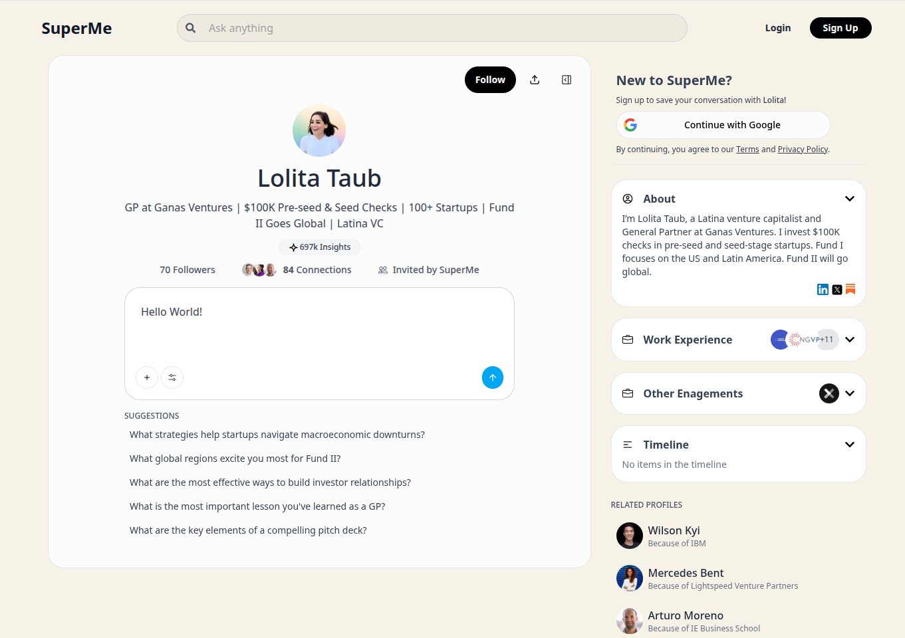
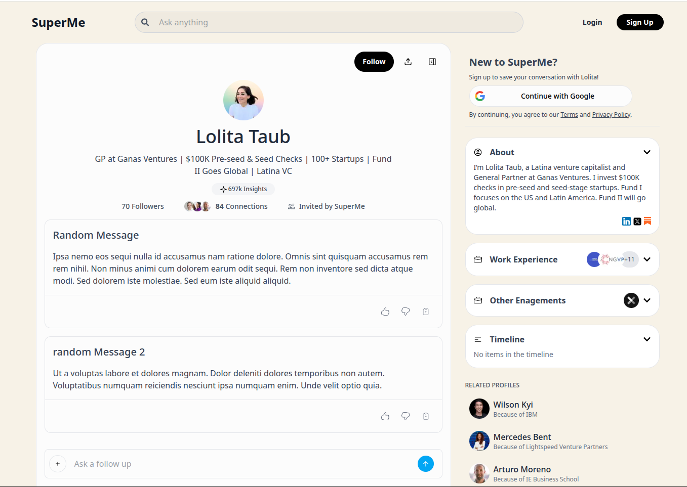

SuperMe UI Clone in Next.js

# Deployed Link
[superme-ui-clone.vercel.app](https://superme-ui-clone.vercel.app)

# Images

Shows the interface when the user has typed into the input, before sending.

Demonstrates the live conversation view with message bubbles and responses.

Dev: `pnpm dev`

Build: `pnpm build`

Start: `pnpm start`

Open http://localhost:3000
